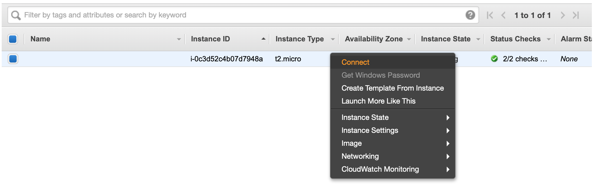

:source-highlighter: highlightjs

= Amazon Web Services (AWS)

== AWS EC2: Virtual Machine (VM)

=== Conectar em uma VM

[source,bash]
----
ssh -i sua-chave-privada.pem usuario@ip-ou-dominio-vm
----

As informações concretas para conectar à uma determinada VM podem ser obtidas
clicando-se com o botão direito na sua VM, acessando sua conta do http://console.aws.amazon.com[AWS].

=== Enviar arquivos para a VM

Podemos usar o comando SSH Copy (scp) para isso:

[source,bash]
----
scp -i sua-chave-privada.pem arquivos-origem-maquina-local usuario@ip-ou-dominio-vm:/pasta-destino-maquina-remota/
----

// == AWS ECS: Docker Container

